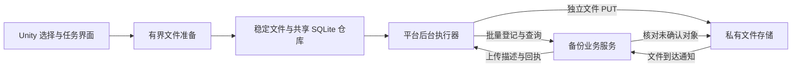

# 照片备份批量协议与后台执行实施计划

日期：2026-10-01

状态（2026-10-02）：v2 客户端、共享仓库、参考服务和四平台产物已实现，本机回归及移动发布构建已通过。执行证据见 [GalleryBackgroundProtocolExecution.md](GalleryBackgroundProtocolExecution.md)。真机后台、24小时负载、Windows 实际运行、生产云及同条件旧版性能基线尚未验收，不能宣称全部发布门槛完成。

实施后已按39条阶段清单及B01–B24逐项复核，发现的取消/凭据释放、移动追加受理、授权到期推进、服务网络锁及iOS聚合问题已修正。逐项结论见 [GalleryBackgroundProtocolAudit.md](GalleryBackgroundProtocolAudit.md)；当前31项完成、8项仍未验收。

适用范围：Unity / UIFrame，Android、iOS，以及桌面与 Editor 的协议验证路径。

当前行为见 [Gallery.md](Gallery.md)，既有证据见 [GalleryValidation.md](GalleryValidation.md)。本计划承接[长期照片备份计划](GalleryLongTermBackupPlan.md)和[最初实施方案](GalleryImplementationPlan.md)，只调整备份协议、交接和执行流程；通用 SQLite 的职责仍由其[实施计划](../Runtime/Sqlite/ImplementationPlan.md)规定。实施必须遵守 [ErrorContract.md](ErrorContract.md)。

## 1. 交付目标与边界

将当前“每张照片准备完成 → C# 建立服务器会话 → 原生交接”改为“本地有界准备 → 持久交接 → 原生批量登记 → 独立文件上传 → 服务端确认 → 客户端取得回执”。文件准备不等待前一张照片的网络请求，已经交接的任务不依赖 Unity 持续运行。

完成后必须满足：

1. 一批元数据请求可以登记多张照片、查询多个结果；照片内容保持独立传输和独立失败边界。
2. C#、Android、iOS 共用一份 BackupRepository 状态机，平台不保存另一套业务状态。
3. 生产可使用私有对象存储直传；客户端执行统一 HTTP 上传描述，不绑定云厂商 SDK。
4. 服务器可在客户端退出后独立核验文件并提交备份记录。客户端不能仅因 PUT 成功就显示备份完成或删除暂存照片。
5. 重复登记、响应丢失、取消竞争、进程中断和迟到回调不产生假成功、不覆盖新尝试、不提前释放在用文件。
6. 内存、暂存空间和活动任务数量受预算控制；启动和恢复不加载整个图库、全部任务历史或全部服务器备份清单。

本轮交付客户端、共享仓库、新协议、本机参考服务、故障验证及构建产物。生产云账号、域名、业务登录接入、正式部署和生产容量验收需要实际环境，不能用参考服务测试代替。

后台发现新照片、后台导出尚未准备的照片、视频 / Live Photo / RAW 成套备份、双向删除、自动删除手机原图、端到端加密和通用分片引擎不在本轮范围。应用退出前未完成准备的照片仍需应用获得执行机会后继续处理。Android 强行停止和 iOS 用户强制退出之后，不承诺继续运行。

## 2. 当前实现与改造位置

以下为编写本文时的代码事实，不是新方案的完成记录。

| 现状 | 对应位置 | 本轮变化 |
| --- | --- | --- |
| 本机参考服务已经存在，生产服务未接入 | `Tools~/BackupServer/server.py` | 同步实现新协议，保留可执行端到端验证 |
| `ProcessTasksAsync` 逐张 `CreateSession` 后调用原生 submit | `Runtime/MediaBackup/ImageBackupService.cs` | 网络登记移至执行端，批量接收和交接 |
| 自动扫描按单张准备后等待处理 | `Runtime/MediaBackup/AutomaticImageBackup.cs` | 有界准备队列与传输队列分别推进 |
| Prepare / Seal / Accept 和 Handoff / Submitted / Start 已持久化 | `Runtime/MediaBackup/Native~/src/repository.cpp` | 延续所有权规则，增加控制请求和传输阶段 |
| 原生只上传已经创建服务器会话的文件 | Android `BackupBridge.java`、iOS `UIFrameBackup.mm` | 原生可执行 Plan、Upload、Query、Cancel |
| Android 使用普通 JobScheduler | `BackupJobService.java`、Android Manifest | 保留自动调度，增加用户主动传输的系统适配 |
| iOS 已使用文件式后台 URLSession，最多保留 16 个系统任务 | `Runtime/Plugins/iOS/UIFrameBackup.mm` | 小型清单同样作为文件式后台请求，区分排队数量与实际传输并发 |
| 后台整文件接口收完即校验并提交回执 | `Tools~/BackupServer/server.py` | 将此正确语义延续到独立文件存储，避免新增对客户端 commit 的依赖 |
| 原生上传结果按业务服务返回的 JSON 回执解析 | 两端原生适配 | 区分存储传输响应和业务回执，支持无 JSON 的成功 PUT |
| 能力信息已按服务实例缓存 | `EnsureCapabilities` | 不将既有实现误记为逐张查询；新协议在批量响应中返回版本与限制 |

## 3. 固定架构与职责



| 模块 | 唯一职责 |
| --- | --- |
| Unity / C# | 用户操作、图库授权与准备、显示和控制；桌面执行适配；不控制移动后台任务的最终状态提交 |
| 共享 BackupRepository | 任务事实、执行代次、下一步动作、批次关联、回执、资源归属、暂停取消和清理资格 |
| Android / iOS | 系统调度、流式 HTTP、受保护凭据、回调和实际资源释放；不复制 SQL 和业务状态转换 |
| 备份业务服务 | 账号隔离、批量登记、内容复用、上传授权、服务端核验、备份记录、结果查询和取消仲裁 |
| 私有文件存储 | 按上传授权保存字节，提供对象身份、大小和可验证校验结果；不替代业务备份记录 |

所有 HTTP、文件复制、哈希和系统调度都在数据库事务外执行。仓库以短事务发出工作、接收结果；操作系统调用与 SQL 无法组成一个事务，必须保留提交前后可恢复的关联记录。

本轮直接采用新协议，不保留旧 `/v1/uploads` 上传路径、旧状态解析、自动协议降级、旧 JSON 或旧 schema 迁移逻辑。协议和当前 schema 的严格版本校验仍然必要；不支持时明确失败，不能自动删除重建。测试使用新的隔离数据目录；任何现有开发数据清除均是显式操作。

### 3.1 合理性、维护成本与效率的取舍

本轮选择“有界流水线 + 滚动批量确认”，不以整个相册或整个上传批次全部成功作为确认前提。判断优先级为：备份结果和资源所有权正确，其次是后台接管与中断恢复，再比较总耗时、内存、磁盘、流量和耗电。请求数量只是其中一个指标。

| 决策 | 解决的实际问题 | 控制复杂度的方式 |
| --- | --- | --- |
| 准备、上传、确认独立推进 | 网络等待不阻塞后续准备，慢文件不拖住已完成项 | 共用仓库和调度规则，不为单张 / 多张照片建立两套流程 |
| 元数据合批、照片独立 | 减少往返，同时限制单项故障影响 | 批次只是传输和事务单位，不增加“全部成功才能提交”的业务事务 |
| 服务端独立确认 | 客户端退出后仍可完成备份记录 | 数据库待确认记录和有限工作循环即可起步 |
| 一个 HTTP 协议、平台适配系统能力 | 保持三端语义一致 | 不加入云厂商客户端 SDK、运行时后端探测或失败后自动切换 |
| 参数以实测确定 | 避免为理论吞吐增加内存和暂存峰值 | 先使用有限默认值；未证明收益前不增加自适应调参和并发控制器 |

第一版不增加通用工作流引擎、上传主从选举、通用分片、客户端常驻连接、强依赖推送或分布式中间件。新增字段、状态或锁必须对应具体的协议事实、所有权转移或已验证的并发问题；不能仅以“以后可能用到”为理由加入。

商业实现并非都需要在 PUT 后额外查回执：业务上传接口如果已经承诺并返回校验后的持久备份回执，直接消费该结果即可。本轮面向对象存储直传，存储 PUT 成功与业务备份记录确认分属不同职责，因此采用独立 Query；这是本项目所选协议的必要步骤，不是所有上传系统的通用要求。Plan / Query 已返回有效回执的项立即应用，不为它重复查询。

## 4. 身份、去重与取消的基础规则

| 身份 | 定义与用途 |
| --- | --- |
| 账号 | 由认证得到；请求体不能指定或覆盖真实账号 |
| 来源版本 | `sourceNamespace + sourceId + sourceVersion`；namespace 区分设备 / 提供者，不能把本地相册 ID 当作跨设备唯一 ID |
| 内容对象 | 账号内的 `SHA-256 + byteCount`，代表服务器已经核验的不可变字节 |
| clientTaskId | 本地受理前确定并持久保存；重复请求不得生成另一份逻辑备份 |
| attemptGeneration | 某任务的一次执行代次，单调增加；迟到回调只允许影响自己的代次 |
| uploadId | 服务器分配的上传尝试，对应确定账号、任务、代次和内容；不能指向另一次尝试的可写对象 |
| requestId | 一次控制请求的稳定 ID，对应固定条目与参数指纹；结果不明时用于核对，不以换 ID 掩盖同次失败 |

照片记录和内容对象分别存储。同一账号内不同来源可以引用同一已核验对象，并保留各自名称、来源和版本。服务器对同一来源版本收到不同内容时报告冲突；不能悄悄覆盖。跨账号不提供“全局哈希存在即可秒传”的接口。

只复用已核验内容。同一内容的首次并发上传可以拥有不同临时尝试，最终按唯一约束合并内容对象；第一版不增加客户端上传主从选举和共享在途文件的接管状态机。确认后的重复文件必须零照片字节上传；并发首次重复的额外流量单独计量。

取消一个任务只撤销该任务的未完成提交资格，不删除已确认的服务器备份，也不删除其他记录引用的内容。服务器原子裁决确认和取消：已经确认则返回回执；取消先被接受则保存禁止该尝试再确认的记录。旧签名地址仍可能收到字节，但旧尝试不能因此发布备份记录；这些字节按独立临时资源回收。

## 5. 协议 v2：四类操作

机器契约已落在 [GalleryBackupProtocol.openapi.yaml](GalleryBackupProtocol.openapi.yaml)，可执行夹具见 `Tools~/BackupServer/fixtures/protocol-v2.json`。客户端和参考服务以此为准，生产服务接入也必须遵守相同契约。

| 操作 | 建议接口 | 契约 |
| --- | --- | --- |
| Plan | `POST /v2/backup/plans` | 批量登记来源版本和内容，返回逐项回执、上传描述或拒绝原因 |
| Upload | 上传描述中的 HTTPS URL，方法固定为 PUT | 单文件流式上传，不附加业务账号的通用 Bearer Token |
| Query | `POST /v2/backup/status` | 按固定任务 / 代次批量查询，可在 Plan 响应丢失、尚无 uploadId 时查询 |
| Cancel | `POST /v2/backup/cancellations` | 逐项撤销尚未确认尝试，返回确定取消、已确认或明确错误 |

### 5.1 控制请求与响应

Plan 请求包含 `protocolVersion`、`requestId` 和 `items`。每项包含 `clientTaskId`、`attemptGeneration`、来源版本、`sha256`、`byteCount`、`mimeType` 和显示名称。示意如下，花括号内字符串为字段示意而非可执行夹具：

```json
{
  "protocolVersion": 2,
  "requestId": "{persistent-request-id}",
  "items": [
    {
      "clientTaskId": "{persistent-task-id}",
      "attemptGeneration": 1,
      "sourceNamespace": "{installation-and-provider}",
      "sourceId": "{provider-item-id}",
      "sourceVersion": "{source-version}",
      "sha256": "{64-lowercase-hex}",
      "byteCount": 4194304,
      "mimeType": "image/jpeg",
      "name": "photo.jpg"
    }
  ]
}
```

服务器校验账号和整个请求结构，再逐项处理。正常业务响应必须覆盖全部请求条目，每项以任务 ID 和代次对应，不依赖数组顺序。重复条目、缺项、多项、错账号、错哈希和未知状态均是协议错误，不补全默认结果。无效批次响应不能发布其中的成功；其他独立批次不因此成为失败。

| 逐项结果 | 含义与下一步 |
| --- | --- |
| Confirmed | 有完整回执；校验后保存，可进入资源释放流程 |
| UploadRequired | 有确定上传描述；交给文件传输调度 |
| Pending / Verifying | 已登记或正在核验；记录下次检查时间，等待执行机会 |
| Rejected | 明确错误码与原因；该项终止，不重试整个批次 |
| Canceled | 服务器已经撤销该尝试的提交资格；仍须等待本地实际执行者释放 |
| Absent | Query 未找到记录；仅表示查询时不存在，不能据此证明仍在途的 Plan / Upload 不会产生结果 |

Plan 的首次正常结果使用 Confirmed、UploadRequired 或 Rejected；Query 可返回上表其他状态。Cancel 必须对未登记尝试也留下可仲裁的取消记录，不能用一次 Absent 查询替代取消确认。

重复 requestId 的参数指纹不匹配返回冲突；相同参数对应同一登记事实。动态结果可从待上传推进到已确认，临时授权也可更新，不要求响应字节永远相同。客户端按代次、请求归属和当前动作验证响应后再应用。

批量响应附带协议版本、条目 / 字节限制和服务器时间。避免逐项能力探测。客户端只使用明确支持的 v2；显式配置越界报错，不静默截断请求或切回旧协议。

### 5.2 上传描述与凭据

上传描述至少包含 `uploadId`、任务 ID、代次、内容哈希、字节数、绝对 URL、必要请求头、`expiresAt`、允许的成功状态码。第一版只支持原文件 PUT，不引入任意脚本、上传插件或运行时拼接协议。

客户端逐项校验描述与准备文件一致。系统从文件发送字节，不加载整张照片到内存；传输成功响应可以没有 JSON。HTTP 成功只记录传输完成，之后通过 Query 取得业务回执。

上传使用描述指定的凭据，业务 API 凭据只用于业务域名。生产仅允许 HTTPS；本机测试沿用明确开启的局域网 HTTP 配置。业务、存储及网关必须提供可信的最终终点，不得返回重定向；客户端不得把业务凭据复制给存储，也不得在日志输出完整签名 URL。

Desktop / Android 禁止自动重定向。iOS 保留 background NSURLSession，系统会跟随重定向且不调用重定向代理；客户端检查最终 URL，并在系统提供任务 metrics 时识别跳转。检测到违规不能发布成功，但检测不能阻止或撤回已发送的字节，服务端和网关必须承担不跳转的约束。要求客户端在任何跳转前拦截的产品不能直接采用这一 iOS 后台传输方式。

签名 URL 和授权请求头同样属于凭据，由 AndroidKeyStore / Keychain 支持的受保护存储管理；SQLite 保存受保护引用。清单请求文件不写入 Bearer Token。凭据释放必须等待关联的实际系统执行结束，不能因为 C# 门面关闭就删除。

后台调度延迟必须纳入授权有效期设计。已知未开始上传且授权到期时，在系统允许执行时通过 Plan 更新上传描述；确定没有旧执行者后才替换它。已经发送且结果未知时先核对，不能因 403 或本地时钟到期就宣称服务器未提交。认证失败不会静默换凭据或无限重新登记。

### 5.3 服务器回执与独立确认

回执至少包含 `backupId`、任务 / 来源版本关联、`sha256`、`byteCount`、`confirmedAt`。账号由认证上下文绑定，客户端必须校验该上下文与仓库账号一致。

业务服务在 Plan 阶段持久保存备份意图。文件到达后，由存储服务或后端验证实际大小和内容校验值，再原子提交备份记录与内容引用。不能把客户端自报 hash、对象自定义元数据或通用 ETag 直接当作已经验证的 SHA-256。

核验绑定确定的对象版本。可写上传目标与已确认内容必须隔离：使用不可变对象版本或将已核验对象发布到上传授权不可写的位置。仍未过期的签名不能覆盖已经确认的字节；临时对象的后续写入也不能使既有回执引用其他内容。

对象通知按可能重复、可能遗漏设计：处理幂等；持久保存待确认上传，后台按游标和时间索引核对缺失通知的对象。第一版可用数据库待确认表和一个工作循环实现，不要求新增分布式中间件。

服务器确认不要求客户端再发 commit。客户端提交结果提示可以加快核对，但不能成为正确性前提。已有回执的照片即使本地清理失败，备份状态仍是成功。

## 6. 本地接收、交接与执行流程

### 6.1 对外成功点

拟定主入口为 `SubmitAsync(operationId, images, cancellationToken)`，每次 1–32 张；大量来源由自动备份按页持续调用。P0 固定 DTO 和签名后才修改公开 API。原有“准备后再调用 ProcessAsync”不继续作为移动端主业务用法；保留的底层准备 / 驱动函数收为内部职责，不增加旧行为兼容包装。

operationId 和每项任务 ID 在副作用前确定。可通过 operationId 查询本次部分或全部受理结果。单文件准备失败记录在该项，继续处理同批其他独立照片；最终抛出携带逐项结果和已受理 ID 的批量异常，并保留原异常。共享仓库、账号凭据或范围权限故障按实际影响范围停止，不能一律归为单文件错误。

| 可观察进度 | 精确定义 |
| --- | --- |
| Prepared | 稳定文件已 Seal，任务已持久接受；尚不能宣称原生已经接管 |
| NativeAccepted | 文件、必要元数据、可访问的受保护凭据引用及待执行动作已可靠交给原生；后续步骤无需 C# 回调，但服务器仍可能拒绝认证 |
| SystemScheduled | 当前阶段的系统调度已经受理；应同时显示阶段是登记、上传还是核对，不等于照片正在上传 |
| Confirmed | 有校验通过并写入共享仓库的服务器回执 |

这些字段从唯一仓库事实派生，不增加第二份可独立写入的状态机。`nativeOwned` 或 Uploading 不能继续用于推断系统已经受理。

移动后台模式下，SubmitAsync 全部成功返回要求各有效项已被原生接受，并且负责推进这些工作的系统调度已经受理，或任务已确认完成。不要求每张照片都已创建实际文件上传请求。原生接受后系统调度失败必须传播，保留已交接事实并允许按 operationId 查询，不能回滚文件或返回假成功。

桌面模式返回表示应用内执行器受理，不宣称支持退出后传输。关闭 C# 门面不取消已经交接的移动任务；业务取消是独立命令。取消等待也不能撤销已经确定的受理结果。

### 6.2 有界流水线

1. 本地回执与可靠来源版本先排除已处理候选。未知版本需要准备，不能只靠名称、文件长度或时间戳证明内容相同。
2. 准备者先预留磁盘，再流式复制 / 导出并计算哈希、检查来源版本、Seal 文件。无需纹理解码和图片重压缩。
3. 每项独立接受；批量提交短事务及桥接调用可以合并，但不能延续“一张读取失败就放弃所有有效照片”的原子准备语义。
4. 将已经接受的项尽早交接；准备下一批不等待上一批的 Plan 或上传。
5. 原生按当前就绪项组装有界清单、持久保存请求归属并调度 Plan。条目达到上限、最大聚合等待到期、准备轮次结束或进入后台时提交现有尾批。
6. 应用 Plan 结果，独立安排文件上传；空出预算后再允许准备新照片。
7. 上传结束记录传输结果并释放实际网络并发名额，继续安排其他照片；成功传输项进入滚动批量 Query，不等待自己的回执才启动下一张。Pending 是正常未完成，按 nextCheckAt 等待，不持续轮询。
8. 写入有效回执，等待照片文件、控制请求文件和凭据的实际使用者释放，再进入现有有界清理流程。

每张照片来源的复制和哈希尽量合并为一次流式读取，但保留必要的来源一致性与发布前验证。系统提供者导出自身的 I/O 成本单独计量，不能宣称全部照片都只产生一次物理读写。

### 6.3 控制请求与照片文件的所有权

Plan / Query / Cancel 在 iOS 使用小型文件式后台请求。共享仓库仅增加必需的控制请求记录：requestId、类型、固定成员、参数指纹、阶段、文件归属、系统关联和时间。请求文件创建前登记归属，可靠落盘后才可提交；响应应用成功与系统释放是两个确定点。

进程在响应丢失、写库前或释放前结束时，保留真实未知结果和清理责任。不能用“重新生成另一个批次”绕开原请求，也不能把多个任务压进平台自有 JSON 队列。这个记录只服务于四类协议操作，不扩展为通用消息总线。

### 6.4 滚动批量确认

上传调度和确认调度独立推进，但使用同一仓库。网络执行已经结束的上传不继续占据上传名额；其照片文件仍保留，直到确认结果和实际释放条件满足。不能将“允许上传下一张”与“允许删除上一张暂存文件”合并成一个判断。

确认队列只选择到了检查时点的未确认项，按数量与字节限制合批。下列任一条件触发本轮可执行的 Query：

1. 已到期的待确认项达到批量阈值。
2. 最早待确认项达到最大聚合等待时间。
3. 准备因暂存字节或活动窗口预算不足而暂停，且已有到期的待确认项。
4. 当前已有上传队列排空或本次有限提交已结束，提交剩余到期待确认尾批。

这里的等待上限是客户端聚合上限，不是操作系统保证的执行时刻。首次确认的聚合等待与服务器 Pending 的 nextCheckAt 分开定义；服务器明确仍在核验时，空间压力或尾批事件不能绕过 nextCheckAt 触发紧密轮询。预算耗尽且暂无可释放项时，准备保持可观察的等待状态，不提前删文件。

Query 的有效响应逐项处理：Confirmed 写回执并进入释放流程，Pending 保存下一次检查条件，Rejected / Canceled 保存各自终结事实。未完成项不占据队头阻塞已到期项，不反复携带已确认项查询。正在上传、尚未上传以及结果未知需显式核对的失败项，不混入普通确认轮询。

调度器区分“系统排队任务”和“正在联网执行的控制请求”。延后到未来的 Query 不得独占当前可用的控制执行名额，阻塞 Plan 或 Cancel；两端采用同一有限配额及公平性规则。释放容量所需的到期确认不能被持续登记的新照片无限推迟。

一次小批提交可能只产生一次最终查询；长时间持续新增照片时则滚动确认。两者遵守同一规则，不引入手动选择的“最后统一确认模式”。查询有界、逐项可恢复，不创建整个相册的一条全成全败总回执。界面的最终汇总从各项事实计算。

## 7. 仓库、生命周期与失败边界

共享仓库继续独占 catalog 的 SQL。新增数据应尽量扩展现有 task_attempts、files 和操作关联；只有控制请求确需独立持久生命周期时才新增表。回执、来源关系和文件释放仍在现有统一模型内维护。

阶段至少区分待登记、待文件传输、待服务器确认；业务终结结果仍由现有任务状态表达。系统任务关联键包含仓库、控制请求 / 文件任务身份、执行代次及阶段。禁止以进程内字典作为重开恢复依据。

| 事件 | 处理边界 |
| --- | --- |
| 单张源文件读取失败、服务器逐项拒绝、单文件清理失败 | 该项明确失败或清理待处理；持久记录后继续无关项 |
| 相册范围失权 | 暂停该范围依赖授权的工作，等待明确确认；不当作单张失败继续扫描 |
| 一个批次 HTTP 失败或响应结构损坏 | 该批依赖结果未知或失败；其他独立请求保持自身事实 |
| 账号凭据不可用 | 停止依赖该凭据的新请求；不伪造其他账号失败 |
| 数据库提交结果不明 | 停止相关仓库，保留文件和原异常，显式恢复后核对 |
| 系统等待网络、延后调度、服务器 Verifying | 预期未完成，保存状态和下次检查条件 |
| 已发送请求中断且服务器结果未知 | 保存未知结果；不能宣称取消完成或立即重发照片 |

遵守错误契约：已记录失败的业务请求默认不自动重试，也不因框架重开、唤醒或批量补齐而重试。显式 Retry / Reconcile 继续作为业务入口。推进从未执行的工作、接收系统已有任务回调、对正常 Pending 做有期限的检查，不算重新执行已失败操作。

协议幂等只保证允许重提时不重复创建事实，不等于自动获得重试授权。系统底层可能重送网络数据，所以服务器仍须幂等。恢复必须先确认旧执行者实际结束，保留已有取消仲裁与执行代次规则。

所有轮询次数、截止时间和下一次机会都持久化；超过明确确认等待期限转为可观察的 NeedsAttention。第一版不增加无限重试策略。确认检查的等待期限与服务端核验 SLA 在 P0 固定，本机默认测试采用短期限，生产配置明确声明。

## 8. 平台执行

### Android

- 自动备份沿用持久 JobScheduler，执行端直接读取共享仓库，可处理 Plan、Upload、Query、Cancel，不依赖 Unity Activity 或 C# 服务已经建立。
- 用户主动备份：Android 14 及以上使用符合条件的用户发起数据传输任务；较旧支持版本使用带进度通知的前台服务。调度方式由明确的任务模式和平台版本决定，失败后不偷偷切换后端。
- 用户主动模式必须满足系统允许的启动条件。提交时已无前台启动资格，应明确报告受限及已经接受的任务事实；不能将之后的后台自动扫描伪装成用户点击。
- 实施前核对实际 target SDK 对通知、服务类型、启动条件、任务停止原因和执行时限的要求；保持现有最低版本，未经明确决策不提升它。
- 系统停止时先记录阶段与不确定性、断开实际网络执行，再决定尚未执行任务的调度；不能将全部停止原因转换成重试，也不能将停止视为服务器未收到文件。
- 通知展示进度和可用控制。强行停止、厂商限制和省电策略属于真机验收边界，不宣称常驻。

### iOS

- 继续使用 background URLSession。照片、Plan、Query、Cancel 都使用稳定文件作为请求体；元数据 POST 也通过文件式 upload task 执行。
- 回调直接提交到共享仓库，再按预算安排后续阶段。没有 Unity 运行时也必须能定位仓库、取得受保护凭据和调用仓库 ABI。
- 系统恢复时关联已有任务，区分尚未提交、已经提交和已结束的请求。保留 Wi-Fi / 任意网络会话策略，并预留控制请求调度空间，避免照片排队耗尽所有系统任务名额。
- Query 返回正常 Pending 后，将下一次检查持久化并提交带 `earliestBeginDate` 的后台请求，不依赖 Unity 定时器或进程内延时。该时间仅为最早执行时间，系统仍可延后；等待次数和截止时间受第 7 节规则限制。
- 如使用有限后台时间完成正在进行的原生交接，必须实现 expiration 收尾。它不保证完成尚在 C# PlayerLoop 中准备的照片，也不用于循环续命。
- 数据库、WAL / SHM、照片文件、清单文件及凭据分别验证锁屏和首次解锁条件。完成回调发生错误也要及时归还系统 completion handler。
- 本轮不依赖 BGProcessingTask 才能正确确认备份。未来接入时只增加执行机会，不建立第二套队列，也不承诺固定唤醒频率。

### Editor / 桌面

通过同一仓库、协议和测试夹具执行普通 HTTP 路径。移动端控制请求文件的生命周期可在宿主测试验证，但桌面线程和子进程测试不能证明 iOS / Android 系统调度有效。桌面应用退出后传输停止属于明确能力边界。

## 9. 性能与资源预算

以下预算已在实现中固定，宿主验证结果见执行记录；手机 RSS、耗电及吞吐仍需 P7 实测。调整必须保留有界性质并说明测量依据。首次 Query 聚合固定1秒，Pending 遵守 nextCheckAt；第256次 Pending 或24小时截止结束自动确认，转 NeedsAttention。nextCheckAt 等于或超过截止时，已无合法自动查询机会，直接结束自动确认，不提前轮询。

共享仓库将已绑定 Query 的最早成员截止时间提供给执行器及下一调度时点。一个共享请求到达这个截止时，执行器取消该请求，等待实际结束后记录释放；其未确定成员均保留未知结果，须显式核对。暂停 / 恢复不延长已有截止。迟到的有效 Confirmed / Canceled / Rejected 仍是权威结果，Pending / UploadRequired 不能越过截止继续推进。系统未及时唤醒时，不能保证在墙钟截止时刻立即执行取消；下次执行机会必须检查截止。没有待调度时点时，共享接口返回整数0。

| 项目 | 初始预算 / 策略 | 保护的对象与解除条件 |
| --- | --- | --- |
| Plan / Query / Cancel | 每批最多 32 项；请求 256 KiB、响应 512 KiB | 条目和字节任一达到即封批；单项自身超限明确失败 |
| 清单聚合 | 最大等待先以 250 ms 测试；尾批及前后台切换及时提交 | 降低额外排队延迟，不为凑满 32 项无限等待 |
| 回执聚合 | 沿用 32 项及响应字节预算；聚合等待与 nextCheckAt 在 P0 单独固定 | 不逐张立即查询，不因上传队列持续增长而无限延后确认 |
| 单个上传描述 | 总计最多 8 KiB，含 URL 和请求头 | 限制受保护存储与解析成本；过长描述为协议错误 |
| 本地准备 | 每仓库 1 个准备者，复制缓冲复用 | 与已有准备所有权一致，上传不占用准备者 |
| 准备窗口 | 最多 64 个已准备且未确认项，同时受字节预算控制 | 任一预算达到即暂停新准备；确认 / 显式处置释放容量后继续 |
| 暂存照片 | 延续默认 512 MiB、单文件默认 512 MiB、文件系统余量 16 MiB | 按实际可用量和预留量判断；不能通过超额复制解除等待 |
| 控制清单文件 | 总预算先取 8 MiB，独立记账并计入实际磁盘余量 | 文件实际释放后归还预算；不会被照片预算统计遗漏 |
| 执行并发 | 控制请求先取每仓库 1 个；照片活跃传输目标 2 个 | 系统可能进一步降低执行并发；扩容需测耗电、吞吐和内存 |
| iOS 系统任务 | 沿用总上限 16，其中至少留 2 个控制请求名额 | 与照片实际传输并发分别统计；所有会话合计限流 |
| 数据库与桥接 | 沿用单次 1 MiB、有限页和短事务 | 超出业务页拆分；不提高通用上限掩盖全量物化 |

完整照片不进入 JSON、托管 byte[] 或 SQLite BLOB。优先复用流式缓冲，避免逐张创建 HttpClient、数据库连接和原生工作线程。平台系统的内部缓存不计入上述自有缓冲承诺，需额外测量进程 RSS / 原生堆。

已确认内容复用可省上传字节；尚无可靠本地内容证明的照片仍可能需要准备后才能远端判重。不能以“秒传”承诺跳过所有本地读取。

1,000 项约 32 次 Plan 只适用于条目能聚合成满批且不触发字节上限的场景。真实照片准备速度和前后台切换可能产生更多尾批，性能报告必须同时记录平均批大小和首次接管耗时，不能只拿理论请求数宣称收益。

## 10. 参考服务与生产接入

本机参考服务实现完整四类操作、账号内内容复用、私有文件上传、独立确认和取消仲裁。它必须能模拟“对象已经到达，但客户端不再发请求”并完成备份确认。启动恢复只扫描有索引的未完成工作，不全量遍历所有内容文件。

测试提供两个 HTTP origin：业务 API 和私有存储入口。验证文件上传不会携带业务 Bearer Token，上传响应为空时仍能正确核对。参考存储使用本机目录和可过期的受限授权，无需云账号；它是同一协议的测试实现，不作为生产流量容量证明。

生产服务接入必须交付：

- 真实业务认证、账号 / 配额隔离，以及控制请求凭据在后台窗口内的可用规则；无法续期时明确需要重新登录。
- 支持文件 PUT 和校验的私有对象存储，限定对象、方法、有效期和必要请求头的上传授权。
- 持久待确认工作、通知幂等、遗漏通知核对、取消竞争及旧尝试对象的隔离清理。
- 已确认记录与内容的保留策略。临时对象 TTL 不得删除已确认或仍被引用的内容；单文件清理失败与上传隔离。
- HTTPS、实际网络与容量压测、日志脱敏和可观测性。生产 SLA 只能在目标环境验收后填写。

下载和已备份清单仍通过业务接口授权并分页；保持下载校验和既有目标不覆盖的契约。新协议替换时一并更新对应参考接口和测试，不能仅更新上传而遗留失效的下载调用。

## 11. 分阶段执行清单

每阶段的变更、命令、构建 ID、结果和限制见 [执行记录](GalleryBackgroundProtocolExecution.md)。下列勾选按实际证据填写；含真机或长期门槛的条目保持未勾，构建不替代实机验收。

### P0：固定契约和记录基准

- [ ] 完整旧版性能基线：已记录 SDK 组合和旧服务测试，但未取得同条件旧版照片集、准备 / 接管分位数、手机内存和后台数据。不得用测试套件耗时补写性能提升。
- [x] 固定四类操作的 DTO、状态码、批次限制、回执、取消仲裁、授权有效期、确认聚合等待与 nextCheckAt；明确存储成功和业务确认的不同保证。
- [x] 固定 SubmitAsync 与逐项查询的成功 / 部分失败契约，列出准备阶段变化影响的既有 API 和测试。
- [x] 新增 `Docs/GalleryBackupProtocol.openapi.yaml` 和协议夹具；明确 v2 为唯一目标，无旧格式兼容路径。
- [x] 验收：请求和响应示例可校验，Android / iOS 目标 API 已编译链接；身份与所有权的协议出口有宿主回归覆盖，系统调度效果留待 P4 / P5 真机门槛。

### P1：参考服务实现协议和服务端确认

- [x] 改造 `Tools~/BackupServer/server.py` 及 README，拆分逻辑备份记录、已核验内容和上传尝试。
- [x] 实现批量 Plan / Query / Cancel、私有文件 PUT、授权到期、幂等和取消仲裁。
- [x] 实现无客户端 commit 的确认工作和通知遗漏核对，补齐下载与列表契约。
- [x] 在 `test_server.py` 和集成服务中验证独立上传 origin、无 JSON 成功响应、部分失败和服务进程中断。
- [x] 验收：本机客户端停止请求后服务独立确认，服务进程在字节到达后被终止也可重开确认；损坏内容与取消后的旧尝试不能产生回执。

### P2：共享仓库与文件生命周期

- [x] 修改 `Native~/schema/catalog.sql`、`src/repository.cpp`、`include/ufbackup.h` 与 `RepositoryContract.md`，协议实现独立为 `src/protocol.cpp`。
- [x] 新增控制请求持久记录、逐项准备接受、阶段关联、受保护描述引用、确认检查时点及预算记账。
- [x] 将 Handoff 的前提从“已建立服务器会话”改成“原生执行所需本地事实完整”；Submitted 明确绑定具体阶段。
- [x] 延续代次、未知结果、取消仲裁、回执提交和实际释放后清理规则；业务 ABI / schema 更新为2，通用 SQLite ABI 保持3。
- [x] 验收：48个真实进程中断窗口通过；百万历史、相同活动数的恢复查询使用活动索引。宿主进程窗口不代表手机系统回收实测。

### P3：C# 接收与有界准备

- [x] 更新 C# 门面、契约、操作及原生绑定；分页类型沿用 `BackupQueries.cs`，任务结果扩展阶段。按职责拆出 Submission、ExecutionControl、ProtocolExecutor。
- [x] 接入 SubmitAsync 与准确阶段查询，去掉移动路径中逐张 C# CreateSession 的前置依赖。
- [x] 改造 `AutomaticImageBackup.cs`，准备、交接和传输分别推进；保留权限、基线、来源版本与单项失败隔离规则。
- [x] 同步桌面执行器、Editor 任务界面及 `Samples~/GalleryDemo`，显示任务状态与协议阶段；API 另提供精确受理阶段。
- [x] 验收：离线受理、预算等待、单文件失败隔离和 operationId 查询通过 Unity / JNI 宿主验证；移动网络与调度留待真机验证。

### P4：Android 执行适配

- [x] 更新 `BackupBridge.java`、`BackupJobService.java`、用户主动传输组件和 AndroidManifest。
- [x] 执行四类协议操作，限制工作线程与网络并发，使用共享仓库驱动下一阶段。
- [x] 接入用户主动任务 / 前台服务的平台规则、进度通知和停止原因处理；后台恢复不依赖 Activity。
- [x] 扩展 `Tests/Native~/android_backup_binding.py`，构建发布 APK；提供可配置参考服务的 MediaSmoke 和执行记录中的设备操作步骤。
- [ ] 验收：没有 C# 初始化时可登记、上传、写入回执；锁屏、系统停止、强行停止及重新打开分别记录实际行为。

### P5：iOS 执行适配

- [x] 更新 `UIFrameBackup.mm`，为四类操作管理文件式任务、阶段关联、响应预算和系统任务配额。
- [x] 补齐恢复关联、控制请求尾批、有限后台收尾与 completion handler 的错误出口。
- [x] 更新构建处理器的实际必要配置，保持 Wi-Fi 策略与受保护存储规则。
- [ ] 验证系统唤醒时无需 C# 服务即可处理登记响应并提交照片；授权过期、首次解锁前和锁屏回调均有明确结果。
- [ ] 验收：真机运行覆盖从批量清单到服务器确认的完整后台链路；用户强制退出作为受限场景记录，不计入持续运行成功率。

### P6：删除被替代路径并验证构建产物

- [x] 删除旧单张会话创建 / 客户端 commit、旧 HTTP 回执假设、失效 DTO 和接口；没有自动旧路径选择，测试已切换到 v2 并保留故障语义。
- [x] 更新业务仓库四平台库和来源清单，核对 JNI、iOS 头文件及混淆规则。
- [x] 更新 Gallery.md、两个前置计划的实施状态、参考服务 README 和示例；本计划按真实证据勾选。
- [x] 验收：四平台库同源，Android IL2CPP High / Release混淆、iOS IL2CPP High及无签名Release链接通过；Windows仅交叉构建，运行未验收。

### P7：性能、真机和长期验收

- [ ] 执行第 12 节的故障矩阵和第 13 节的基准，记录同条件改造前后结果。
- [ ] 验证 24 小时混合传输、锁屏、网络切换与前后台操作；记录未完成和需要用户处理的原因。
- [ ] 根据实测调整聚合等待、准备窗口和上传并发；保留调整前后证据，不用无限提高预算改善数字。
- [x] 在 `GalleryValidation.md` 写入新版本证据，保留桌面、移动构建、手机实测和生产环境验收的明确区分。
- [ ] 验收：所有客户端必需项通过；生产云仍缺环境时标注未验收，不宣称商业发布已完成。

执行依赖：P0 → P1 / P2 → P3 → P4 / P5 → P6 → P7。P1 与 P2、P4 与 P5 可独立推进，但整合必须使用同一版协议和 ABI；阶段内部先跑受影响的针对性验证，通过后再做对应整合检查。

## 12. 必须覆盖的验收矩阵

| ID | 场景 | 必须观察的结果 |
| --- | --- | --- |
| B01 | 32 项一次登记，响应乱序 | 按任务 / 代次正确对应，不逐张创建会话 |
| B02 | 批内一项文件读取失败或服务器拒绝 | 其他有效项继续；失败和已受理项都可查询 |
| B03 | 结构错误、缺项、重复项、超限响应 | 该批无假成功；原异常可观察，不影响已独立确认的其他批次 |
| B04 | 相同 requestId 同参数 / 不同参数 | 不重复创建备份；参数改变明确冲突 |
| B05 | 同账号同内容不同来源、跨账号同 hash | 已核验内容可复用且保留来源；账号之间不能借 hash 获得数据 |
| B06 | 断网提交、预算耗尽、尾批不足 32 项 | 接收不等待服务器；预算守住；尾批不会无限等待 |
| B07 | 准备完成、接受前后、Handoff 前后中断 | 文件归属确定，不误删已接受数据，不把准备完成当系统受理 |
| B08 | 清单落盘、系统提交、响应应用、资源释放窗口中断 | 按原 requestId / 代次核对；无重复接管与提前删除 |
| B09 | 文件 PUT 返回 200 / 201 / 204 且无 JSON | 只标记传输结果，通过有效回执最终确认 |
| B10 | 文件已到达后客户端立即退出 | 服务器独立核验并确认；无需客户端 commit |
| B11 | 内容损坏、大小不符、通知重复 / 丢失、服务器重启 | 无错误回执；重复确认幂等，遗漏通知能被待确认核对发现 |
| B12 | 取消与确认同时发生；旧 URL 和旧回调迟到；签名重复 PUT | 服务端仲裁一致；旧代次不能确认新任务；确认内容不能被覆盖，其他引用不被删除 |
| B13 | 上传途中断网、响应丢失、查询 Absent | 保留不确定性；不根据一次不存在查询宣称取消完成 |
| B14 | 签名到期、业务凭据失效、跨 origin 与重定向 | 更新条件明确；无无限重试、凭据泄漏或后台假成功 |
| B15 | 权限缩小、来源变化、账号切换、暂停与 Shutdown | 保留既有范围语义和所有权；跨账号无任务串用 |
| B16 | 单文件清理失败、磁盘满、SQLite 提交结果不明 | 清理局部隔离；仓库未知结果停止依赖工作；主异常保留 |
| B17 | Android 无 Unity 启动、锁屏、系统回收与强行停止 | 各自记录真实调度和恢复结果，不合并为一种退出测试 |
| B18 | iOS 系统唤醒、锁屏、首次解锁前、用户划掉 | completion handler 必释放；系统允许场景可推进，受限场景不虚报 |
| B19 | 万 / 十万 / 百万历史记录，同样数量活动任务 | 活动工作内存和恢复查询不随全部历史线性增长 |
| B20 | 24 小时重复提交、取消、核对和清理 | 无持续累积的请求文件、凭据、纹理、连接和无法解释的内存增长 |
| B21 | 32 张中两张持续慢传或失败 | 其余项继续上传、确认及释放；不等待整批成功 |
| B22 | 持续新增照片且上传队列始终不空 | 回执仍按阈值 / 时点合批；到期确认不会被 Plan 饿死 |
| B23 | 暂存预算达到上限且服务器返回 Pending | 到期确认可推进，未到期项不紧密轮询；不越界准备、不提前删除 |
| B24 | 少量照片、最后不足一批、下一次 Query 被系统延后 | 尾批可被系统受理；上传名额已归还，未来 Query 不封锁当前控制工作 |

新增用例应放入现有 Unity Media 测试、原生 repository / 进程中断测试、Android 绑定测试及服务测试中；需要新的协议测试文件时以职责拆分，不创建第二套替身状态机。失败回归验证实际状态和资源释放，不能只断言日志。

## 13. 性能测量与完成判定

P0 固定测试照片集、设备、网络、账号和数据目录。至少覆盖 1,000 张普通照片、100% 新内容 / 50% 已核验内容 / 全部已确认内容、单张接近大小上限，以及万 / 十万 / 百万历史记录且活动任务数相同的场景。

记录以下指标：

- 准备耗时、Prepared → NativeAccepted、NativeAccepted → SystemScheduled 的 p50 / p95；原生接管不应再包含服务器登记往返时间。
- Plan / Query / Cancel 数量、平均批大小、照片上传字节、重复上传字节、实际并发和端到端确认耗时。
- 主线程耗时、托管分配 / GC、原生堆、进程 RSS、暂存照片 / 清单 / WAL 峰值和活动凭据数。拍照系统与对象存储开销单独说明。
- 在固定时间点切后台 / 锁屏 / 系统回收后，已接管任务的确认比例与耗时；分母排除尚未准备的照片，并同时报告其数量。
- 相同网络条件下的耗电与失败原因分布。用户强行停止单独统计，不把系统禁止执行的情况当成算法性能回归。

确定性的门槛：批次和资源硬预算不越界；已确认内容判重不发送照片字节；满批夹具符合批量请求数；单项失败隔离；无假成功、跨代次覆盖和提前释放。吞吐、耗电与真实设备内存数值在 P0 建立基线后设定并于 P7 验收，不在缺少手机证据时编造“最高性能”结论。

最终交付必须附带：协议文件和夹具、实际改动映射、四平台构建来源、测试证据、API 用法、已知限制，以及尚未完成的生产云 / 真机项。每一项完成标记都对应可查证据；旧版本的测试数量不能代替本轮结果。

## 14. 平台语义参考

以下用于明确可靠性边界，不表示本项目已经选择 AWS，也不是本项目的性能测试证据：

- [S3 PutObject](https://docs.aws.amazon.com/AmazonS3/latest/API/API_PutObject.html)：成功响应代表完整对象已经写入，不能据此推导独立业务数据库也已完成备份记录。
- [S3 事件通知](https://docs.aws.amazon.com/AmazonS3/latest/userguide/EventNotifications.html)：至少一次投递，通知可能延迟；消费端必须幂等，客户端不能假定 PUT 完成时业务回执必定已生成。
- [S3 预签名 URL](https://docs.aws.amazon.com/AmazonS3/latest/userguide/using-presigned-url.html)：授权在有效期内可重复使用，同 key 写入可能覆盖对象；实际有效期还受签名凭据影响，因此需要确认内容不可变与明确的凭据期限。
