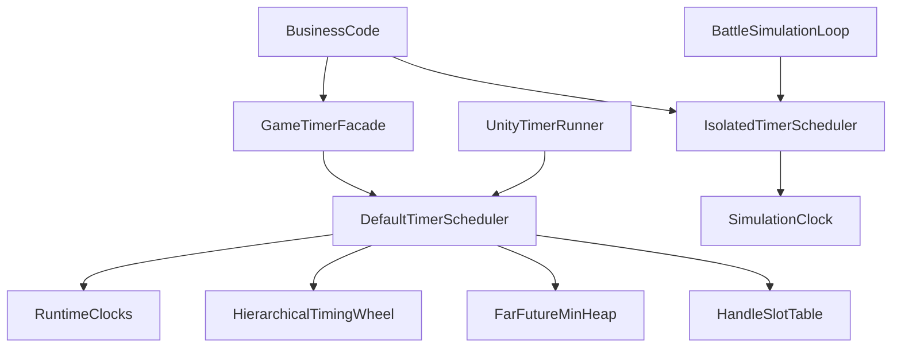

# 高性能 Timer / Scheduler 设计

本文定义项目统一的时间调度基础设施。目标是在大型游戏中稳定承载倒计时、技能冷却、
Buff、UI 延迟、网络超时和确定性战斗时间，同时避免业务层散落 `Update`、Coroutine、
`Invoke` 和无法统一清理的 `UniTask.Delay`。

本文是实现约束，不代表所有业务都应创建 Timer。能够通过“结束时间减当前时间”计算的
状态，应优先保存 Deadline；Timer 只负责在某个时刻唤醒业务。

## 1. 目标

首版实现应满足：

- 支持至少 100,000 个同时活跃的 Timer；
- 时间粒度为 1 毫秒，但运行时回调实际精度不高于 Unity PlayerLoop 的 Tick 频率；
- 支持一次性、有限次数和无限重复 Timer；
- 支持 Scaled、Unscaled、Realtime 和手动推进的 Simulation 四类时钟；
- 支持取消、暂停、恢复、Owner 批量取消和剩余时间查询；
- 支持 FixedRate、FixedDelay 和明确的掉帧追赶策略；
- 支持 UniTask 等待和 `CancellationToken`；
- 回调内注册或取消 Timer 时行为确定，不破坏调度容器；
- 相同 Deadline 的 Timer 按注册顺序稳定执行；
- 核心 Tick、查询、取消和已预留容量内的调度不产生托管 GC；
- 提供容量、积压、追赶和回调耗时等运行指标；
- EditMode 下可使用虚拟时钟完整测试，不依赖真实等待。

性能目标必须在目标设备的 Development Build 中验证，不能只依据 Editor 数据：

- 预留 100,000 容量后，核心调度数据内存目标不超过 16 MB；
- 无到期任务时，Tick 只处理时钟推进和必要的桶迁移；
- 10,000 个 Timer 同帧到期时受预算保护，不允许无上限占满主线程；
- 容量预热后，连续 Tick、Cancel、Pause、Resume 不产生 `GC.Alloc`；
- 业务传入闭包、创建新委托、使用 UniTask 等待所产生的分配不属于核心调度器的
  零分配承诺。

## 2. 非目标和边界

以下能力不放入通用 Scheduler：

- Cron、每天几点执行等日历调度；
- 离线期间精确执行每一次历史回调；
- 服务器活动状态的最终裁决；
- 跨进程持久化 Timer；
- 后台线程直接执行 Unity 回调；
- 帧同步战斗中的网络同步、回滚快照和随机数管理；
- 用 Timer 保存业务真实状态。

活动结束、体力恢复等跨会话逻辑应保存服务器 Unix Deadline。客户端 Timer 只能作为
刷新或请求的触发器，触发后必须重新依据服务器状态校验。

### 2.1 严格契约与 Fail Fast

系统不为错误调用顺序、无效参数或越权操作编写特殊兜底逻辑。默认公开 API 采用严格
契约，调用方违反约定时立即抛出包含 SchedulerId、Handle、Owner、当前状态和调用 API
的明确异常，不能静默忽略、自动修复或猜测调用意图。

必须在所有构建中检查并报错：

- 未 Init 就调度、重复 Init、重复 Shutdown 或 Shutdown 后继续调用；
- Delay 为负数、重复次数非法、重复 Timer 的 Interval 不大于 0；
- 传入空 Callback、全零 `TimerOptions` 或未创建/已释放的 Owner；
- 使用默认、已到期、已取消、已释放或属于其他 Scheduler 的 Handle 执行修改操作；
- 对 Scheduled Timer 调用 Resume、对 Paused Timer 再次 Pause；
- Owner 仍有活跃 Timer 时直接 ReleaseOwner；
- 在非创建线程调用 Scheduler；
- 在回调中调用 Tick、Clear、Dispose 或 Shutdown；
- 超出硬容量后继续使用强制 Schedule。

以下行为明确禁止：

- 自动创建默认 Scheduler；
- 自动切换到主线程；
- 自动把负数时长改为 0；
- 自动替换非法枚举或非法配置；
- 自动取消 Unity 对象关联的 Timer；
- 自动吞掉重复取消、重复释放和跨 Scheduler 操作；
- 容量不足时偷偷扩容、丢弃旧 Timer 或降低精度；
- 回调异常后假装成功并继续重复执行。

只有调用方确实面对“结果可能已被其他正常流程完成”的预期竞态时，才使用名称明确的
`TryCancel`、`TryPause`、`TryResume`、`TryReleaseOwner` 或 `TrySchedule`。`Try*`
返回 false 只表示其方法文档列出的预期未完成条件，不负责吞掉参数错误、跨线程、
跨 Scheduler、非法配置和已 Dispose 等编程错误；这些情况仍然抛异常。

高成本的内部容器一致性扫描可以只在 Editor 和 Development Build 开启，但参数、
线程、所有权和生命周期检查开销固定且很小，Release Build 也不能关闭。

异常类型应让问题可以直接定位：

- 空 Callback 使用 `ArgumentNullException`；
- 负时长、非法次数、非法枚举和非法容量使用 `ArgumentOutOfRangeException`；
- Scheduler 已关闭使用 `ObjectDisposedException`；
- 未初始化、重复初始化和错误状态转换使用 `TimerStateException`；
- Handle 或 Owner 跨 Scheduler、过期或 Generation 不匹配使用
  `TimerOwnershipException`；
- 非创建线程调用使用 `TimerThreadException`；
- 强制调度超过硬容量使用 `TimerCapacityExceededException`。

异常消息禁止只写 “Invalid timer”。至少包含 API 名、SchedulerId、Slot、Generation、
期望状态、实际状态和处理建议；Release Build 可以省略昂贵的回调堆栈采集，但不能
省略核心定位字段。

## 3. 总体架构



系统分为四层：

1. `ITimeSource`：只提供单调递增的整数毫秒时间。
2. `TimerScheduler`：纯 C# 调度核心，不依赖 `MonoBehaviour`。
3. `UnityTimerRunner`：在 Unity PlayerLoop 中读取时钟并驱动默认调度器。
4. `GameTimer`：进程内默认静态入口，负责显式初始化和关闭。

默认调度器用于普通 World、UI 和 Network Timer。大型独立模块可以直接创建
`TimerScheduler`，隔离容量、预算和故障范围。确定性战斗必须使用独立
`SimulationClock`，不得接入默认运行时调度器。

## 4. 时间表示与时钟

### 4.1 整数毫秒

调度核心统一使用 `long` 毫秒：

```csharp
public interface ITimeSource
{
    long NowMs { get; }
}
```

使用整数而不是累计 `float deltaTime`，避免长时间运行后的浮点精度退化，也使录像和
帧同步结果可复现。Delay 小于 1 毫秒时向上取整为 1 毫秒；Delay 为 0 表示下一次
Scheduler Tick 最早可执行，不允许在当前回调批次递归执行。

所有时钟都必须单调不回退。运行时适配器读取 Unity 的 double 时间后转换为毫秒，并将
Unity 平台时间的异常回退钳制到上一次值并输出节流告警。自定义 `ITimeSource` 或
SimulationClock 回退属于调用方违反契约，Scheduler 必须抛出 `TimerClockException`，
不能静默钳制。

### 4.2 Runtime 时钟

`TimerClock` 定义为：

```csharp
public enum TimerClock : byte
{
    Scaled = 0,
    Unscaled = 1,
    Realtime = 2,
    Simulation = 3
}
```

- `Scaled`：读取游戏缩放时间。`Time.timeScale = 0` 时停止，适用于技能、Buff 和
  普通世界逻辑。
- `Unscaled`：不受 `timeScale` 影响，适用于 UI、暂停菜单和本地展示动画。
- `Realtime`：单调真实运行时间，适用于请求超时、心跳和需要跨游戏暂停继续推进的
  本地逻辑。
- `Simulation`：只由战斗模拟主动推进，适用于帧同步、录像和可重复测试。

Runtime 三种时钟分别拥有自己的调度容器。不能把不同时间域的 Deadline 放入同一个
时间轮后仅靠换算比较，否则暂停和缩放会破坏排序。
各时钟域共享 Scheduler 的节点池与总容量上限；100,000 容量指该 Scheduler 内所有
时钟域的活跃 Timer 总数，不是为每个时钟域分别预留 100,000 个节点。

### 4.3 SimulationClock

SimulationClock 不读取 Unity API：

```csharp
public sealed class SimulationClock : ITimeSource
{
    public long NowMs { get; }

    public void AdvanceBy(long deltaMs);
    public void AdvanceTo(long targetMs);
}
```

约束：

- 只允许前进，传入负数或小于当前时间的目标值时抛出异常；
- 战斗层应使用固定整数步长，例如每逻辑帧推进 50 ms；
- 相同输入、相同注册顺序和相同预算配置必须得到相同回调顺序；
- Simulation Scheduler 禁止读取 Stopwatch、Unity Runtime 时钟和本地系统时间；
- 不允许使用基于机器执行耗时的预算中断，只能使用固定回调数量预算。

### 4.4 服务器时间

服务器 Unix 时间不是直接驱动 Scheduler 的单调时钟。建议单独实现
`ServerTimeService`：

```text
estimatedServerUnixMs =
    synchronizedServerUnixMs +
    (realtimeNowMs - realtimeAtSynchronizationMs)
```

校时应平滑修正偏差并保证提供给展示层的时间不倒退。服务器 Deadline 的推荐流程：

1. 保存服务器下发的绝对 Unix Deadline；
2. 使用 `deadline - estimatedServerUnixMs` 展示剩余时间；
3. 使用 Realtime Timer 进行本地唤醒；
4. Timer 到期后重新计算或请求服务器，不直接认定活动结束；
5. 每次校时后重新评估受影响的 Deadline。

不要使用 `DateTime.Now` 驱动游戏 Timer。系统时间可能被用户修改，也可能因时区或
网络校时发生跳变。

## 5. 公开 API

API 分为无分配核心入口和便利入口。以下签名用于约束实现，具体文件拆分可在编码阶段
调整。

```csharp
public readonly struct TimerHandle : IEquatable<TimerHandle>
{
    public int SchedulerId { get; }
    public int Slot { get; }
    public uint Generation { get; }
    public bool IsValid { get; }
}

public delegate void TimerCallback(in TimerContext context);

public readonly struct TimerContext
{
    public TimerHandle Handle { get; }
    public object State { get; }
    public long ScheduledTimeMs { get; }
    public long ActualTimeMs { get; }
    public int CoalescedFireCount { get; }
}
```

Handle 是被动值对象，不提供 `handle.Cancel()`。调用方必须把 Handle 传回创建它的
Scheduler，避免 Handle 隐式持有 Scheduler 引用或通过全局注册表查找。

```csharp
public interface ITimerScheduler : IDisposable
{
    TimerHandle Schedule(
        long delayMs,
        TimerCallback callback,
        TimerClock clock = TimerClock.Scaled,
        object state = null,
        TimerOwner owner = default);

    TimerHandle Schedule(in TimerOptions options, TimerCallback callback);

    TimerHandle ScheduleAt(
        long deadlineMs,
        TimerCallback callback,
        TimerClock clock = TimerClock.Scaled,
        object state = null,
        TimerOwner owner = default);

    bool TrySchedule(
        in TimerOptions options,
        TimerCallback callback,
        out TimerHandle handle);

    void Cancel(TimerHandle handle);
    bool TryCancel(TimerHandle handle);
    int CancelOwner(TimerOwner owner);
    void Pause(TimerHandle handle);
    bool TryPause(TimerHandle handle);
    void Resume(TimerHandle handle);
    bool TryResume(TimerHandle handle);
    bool IsActive(TimerHandle handle);
    long GetRemainingMs(TimerHandle handle);
    bool TryGetRemainingMs(TimerHandle handle, out long remainingMs);

    TimerOwner CreateOwner();
    void ReleaseOwner(TimerOwner owner);
    bool TryReleaseOwner(TimerOwner owner);
    void Reserve(int timerCapacity, int ownerCapacity);

    TimerTickResult Tick();
    TimerSchedulerStats GetStats();
    void Clear();
}
```

默认入口：

```csharp
GameTimer.Init(transform, options);
TimerHandle handle = GameTimer.Schedule(1000, OnTimeout);
GameTimer.Cancel(handle);
GameTimer.Shutdown();
```

未初始化时调用调度 API 应抛出明确的 `InvalidOperationException`。重复 Init、绕过
Shutdown 直接 Dispose 默认 Scheduler、重复 Shutdown、或关闭后继续调度也应报错。
默认入口不提供静默兜底；Launch 已通过自身的 teardown guard 保证只执行一次关闭流程。

`ScheduleAt` 接收当前时钟域中的绝对单调 Deadline，适合大量任务已经拥有 Deadline
的场景，可避免业务重复查询 Now 和自行处理加法溢出。Deadline 早于当前时间时属于
已到期的有效任务，进入下一次 Tick；`Schedule` 的负 Delay 则属于参数错误并抛异常。

严格方法和 Try 方法必须成对保持同一套校验。以 Cancel 为例：

- `Cancel`：Handle 已自然到期、已取消或处于错误状态时抛出
  `TimerOwnershipException` 或 `TimerStateException`；
- `TryCancel`：Handle 已自然到期或已被另一条正常清理路径取消时返回 false；
- 两者遇到默认 Handle、跨 Scheduler、非主线程或已 Dispose 时都抛异常。

### 5.1 TimerOptions

```csharp
public readonly struct TimerOptions
{
    public TimerClock Clock { get; init; }
    public long DelayMs { get; init; }
    public long IntervalMs { get; init; }
    public int RepeatCount { get; init; }
    public TimerRepeatMode RepeatMode { get; init; }
    public TimerCatchUpPolicy CatchUpPolicy { get; init; }
    public TimerCatchUpOverflowPolicy CatchUpOverflowPolicy { get; init; }
    public byte MaxCatchUpPerTick { get; init; }
    public TimerExceptionPolicy ExceptionPolicy { get; init; }
    public TimerOwner Owner { get; init; }
    public object State { get; init; }
}
```

规则：

- `RepeatCount = 1` 表示只执行一次；
- `RepeatCount > 1` 表示总执行次数，不是首次执行后的额外次数；
- `RepeatCount = -1` 表示无限重复；
- 其他负数和 0 非法；
- `DelayMs` 小于 0 非法，不能自动钳制；
- 重复 Timer 的 `IntervalMs` 必须大于 0；
- `MaxCatchUpPerTick` 至少为 1，并受 Scheduler 全局上限约束；
- 所有枚举值必须通过显式范围判断验证，未知值直接抛错且热路径不使用反射或装箱；
- 默认值应由明确的静态工厂创建，不能依赖全零 struct 猜测业务语义。

推荐工厂：

```csharp
TimerOptions.Once(long delayMs, TimerClock clock = TimerClock.Scaled);
TimerOptions.Repeat(
    long delayMs,
    long intervalMs,
    int repeatCount = -1,
    TimerClock clock = TimerClock.Scaled);
```

### 5.2 TimerOwner

直接使用任意 `object` 作为 Owner 会使 Owner 字典生命周期不清晰，也会受
`UnityEngine.Object` 特殊空值语义影响。核心 API 使用由 Scheduler 创建的值类型 Token：

```csharp
public readonly struct TimerOwner
{
    public int SchedulerId { get; }
    public int Slot { get; }
    public uint Generation { get; }
}

TimerOwner owner = scheduler.CreateOwner();
scheduler.CancelOwner(owner);
scheduler.ReleaseOwner(owner);
```

每个 Timer 同时挂入时间轮链表和 Owner 链表，因此 `CancelOwner` 只遍历该 Owner 的
Timer，不扫描全局 100,000 个节点。Owner 失效后旧 Token 不能影响复用的新 Owner。
`ReleaseOwner` 要求 Owner 下已经没有 Timer，否则抛错；业务必须先显式
`CancelOwner`。确实存在并发式生命周期竞态时使用 `TryReleaseOwner`，不能在
`ReleaseOwner` 内偷偷代替业务取消 Timer。

MonoBehaviour 推荐在 `OnEnable` 创建 Owner，在 `OnDisable` 取消并释放。需要跨隐藏状态
继续运行时，改在 `Awake` 创建、`OnDestroy` 释放。
Scheduler 不扫描 `UnityEngine.Object`，也不会因宿主被 Destroy 自动取消 Timer。
遗漏 Owner 清理属于调用方生命周期错误，应通过泄漏统计和测试暴露，而不是由 Scheduler
每帧轮询并兜底。

## 6. 核心数据结构

实现采用预分配数组和整数索引，不为每个 Timer 创建托管节点对象。

概念上的节点字段包括：

```csharp
internal struct TimerNode
{
    public long DueTimeMs;
    public long IntervalMs;
    public long Sequence;
    public TimerCallback Callback;
    public object State;
    public int RemainingCount;
    public int NextInBucket;
    public int PreviousInBucket;
    public int NextInOwner;
    public int PreviousInOwner;
    public int OwnerSlot;
    public int HeapIndex;
    public uint Generation;
    public TimerNodeState Status;
    public TimerRepeatMode RepeatMode;
    public TimerCatchUpPolicy CatchUpPolicy;
}
```

实际实现可拆为多个并行数组，减少 Tick 热路径读取不相关冷字段。无论采用结构体数组
还是并行数组，都必须满足：

- 空闲节点通过 Free List 复用；
- Slot 与 Generation 共同验证 Handle；
- Generation 溢出时跳过 0，0 永远表示无效；
- 时间轮桶使用侵入式双向链表，任意 Timer 可 `O(1)` 移除；
- 远期堆保存节点索引，节点反向记录 HeapIndex，取消时可立即 `O(log n)` 删除；
- 不使用只打 Cancel 标记的无限延迟删除，避免长期取消导致堆和内存膨胀；
- Sequence 使用单调 `long`，解决同 Deadline 的稳定顺序；
- 达到硬容量上限时 `TrySchedule` 返回 false，`Schedule` 抛出容量异常。

启动阶段调用 `Reserve(100_000, expectedOwnerCapacity)` 预留节点、Owner 和远期堆
容量。默认大型游戏配置禁止运行时扩容，达到上限后 `Schedule` 抛出容量异常，
`TrySchedule` 返回 false。若项目明确允许扩容，必须在初始化配置中主动打开并记录
一次诊断告警，不能在容量不足时临时猜测或自动切换策略。

## 7. 分层时间轮与远期堆

### 7.1 时间轮布局

每个时钟域使用独立的四层时间轮。默认基础粒度 `TickResolutionMs = 1`，布局为：

- Level 0：256 个槽，每槽 1 ms，覆盖约 256 ms；
- Level 1：64 个槽，每槽 256 ms，覆盖约 16.384 秒；
- Level 2：64 个槽，每槽 16.384 秒，覆盖约 17.476 分钟；
- Level 3：64 个槽，每槽约 17.476 分钟，覆盖约 18.64 小时；
- 超过 Level 3 范围的 Timer 放入远期最小堆。

独立 Scheduler 可以在初始化时显式选择更粗粒度，例如 UI 使用 10 ms、固定 50 ms
逻辑帧的 Simulation 使用 50 ms。各层跨度按基础粒度同比放大，Delay 和 Deadline
向上对齐到下一格。粒度创建后不可修改；系统绝不能在过载时自动降低精度。默认运行时
Scheduler 仍使用 1 ms，以满足全局毫秒级 API 契约。

时间轮注册、普通取消和桶迁移的摊销复杂度为 `O(1)`。远期 Timer 注册和删除为
`O(log n)`，但它们不参与每帧扫描。当远期堆顶进入 Level 3 覆盖范围时，再迁移到
时间轮。

### 7.2 放置规则

根据 `remaining = dueTime - currentTime` 选择能容纳它的最低层。Timer 只能放在一个
容器中。到达高层边界时将对应桶 Cascade 到下一层，重新按实际 DueTime 分桶。

Timer 到期判断必须使用完整的 `DueTimeMs <= nowMs`，不能只依赖当前槽位。这样可以
防止取整、Cascade 和时间跳跃造成提前执行。

同一个到期桶中的链表按 Sequence 顺序插入。若普通尾插已经能够保持注册顺序，则不做
额外排序；从高层 Cascade 或远期堆迁入时仍必须保持 `(DueTimeMs, Sequence)` 顺序。

### 7.3 大跨度时间跳跃

应用从后台恢复时，Realtime 可能一次前进数小时。禁止逐毫秒循环推进时间轮。

当推进量超过配置阈值，例如 4,096 个基础 Tick 时，进入 FastForward：

1. 遍历当前活跃节点一次；
2. 将 `DueTimeMs <= nowMs` 的节点放入到期缓冲；
3. 其余节点按新时间重新分桶或放回远期堆；
4. 按 `(DueTimeMs, Sequence)` 处理到期节点；
5. 记录 FastForward 次数、扫描节点数和耗时。

FastForward 是罕见路径，复杂度 `O(n)`，但比推进数百万空 Tick 更稳定。Scaled 或
Simulation 时间正常按小步推进时不应触发该路径。

## 8. Tick 和回调语义

一次 Tick 的固定阶段为：

```text
读取并钳制时钟
    ↓
推进时间轮并迁移远期任务
    ↓
收集当前批次到期节点
    ↓
按预算依次执行回调
    ↓
根据回调后的状态取消或重新调度
    ↓
提交回调中创建的下一批 Timer
    ↓
更新统计
```

关键规则：

- 回调中创建的 Timer 最早在下一次 Tick 执行；
- 回调中取消尚未执行的同批 Timer，后者本批不再执行；
- Timer 执行自身回调时调用 Cancel，回调返回后不再重复调度；
- 回调中 Pause 当前 Timer，回调返回后进入 Paused；
- Scheduled Timer 调用 Resume、Paused Timer 重复 Pause、重复 Cancel 或取消已到期
  Timer，严格 API 都立即抛错；只有对应 `Try*` 可返回 false；
- 当前批次使用预分配索引缓冲，不创建临时 List；
- 不允许 Scheduler 嵌套 Tick，同一实例重入 Tick 应抛出调度异常；
- 一个回调抛异常不能阻断后续 Timer。

节点状态建议为：

```text
Free → Scheduled → Executing → Scheduled
                  ↘ Cancelled → Free
Scheduled → Paused → Scheduled
Scheduled → Cancelled → Free
```

Cancelled 是执行期间的瞬时状态。非执行节点取消后应立即解除 Callback、State 和 Owner
引用并归还 Free List，避免对象被 Timer 意外保活。

## 9. 重复、追赶和暂停

### 9.1 RepeatMode

```csharp
public enum TimerRepeatMode : byte
{
    FixedRate = 0,
    FixedDelay = 1
}
```

- `FixedRate`：`nextDue = previousDue + interval`，长期不累计帧误差；
- `FixedDelay`：`nextDue = actualExecutionTime + interval`，确保两次实际回调至少间隔
  一个 Interval。

周期性游戏规则默认使用 FixedRate。轮询、重试和回调本身可能耗时的任务通常使用
FixedDelay。

### 9.2 CatchUpPolicy

```csharp
public enum TimerCatchUpPolicy : byte
{
    Coalesce = 0,
    Skip = 1,
    FireAll = 2
}

public enum TimerCatchUpOverflowPolicy : byte
{
    Skip = 0,
    Coalesce = 1
}
```

- `Coalesce`：只回调一次，通过 `TimerContext.CoalescedFireCount` 告知包含了多少个
  周期；默认策略，适合稳定运行。
- `Skip`：只回调一次并丢弃错过周期，下一次对齐到第一个未来周期。
- `FireAll`：逐次补发，但不超过 Timer 的 `MaxCatchUpPerTick` 和全局预算。

即使选择 FireAll，也不能在一次 Tick 中无限追赶。超过上限的部分按配置转为
Coalesce 或 Skip；只有 Skip 的周期增加 `DroppedCatchUpCount`。业务必须明确选择
“合并、跳过还是补发”，不能由掉帧时长隐式决定。默认 OverflowPolicy 为 Skip。
如果全局回调预算先耗尽，剩余周期延后到下一 Tick，不计为丢弃。

默认推荐：

```text
RepeatMode       = FixedRate
CatchUpPolicy    = Coalesce
MaxCatchUpPerTick = 1
```

### 9.3 Pause 和 Resume

Pause 时保存 `remaining = max(0, dueTime - now)`，并立即从时间轮或远期堆移除。
Resume 时使用 `dueTime = now + remaining` 重新放置。

暂停会冻结距离下一次执行的剩余时长，同时重建 FixedRate 基线；不会在恢复后补发暂停
期间的周期。需要在暂停期间继续推进的业务应选择 Unscaled 或 Realtime，而不是暂停
Timer。

## 10. 单帧预算和过载保护

大型游戏不能假设所有到期回调都能在一帧完成。每个 Runtime 时钟域配置：

```csharp
public readonly struct TimerBudget
{
    public int MaxCallbacksPerTick { get; init; }
    public long MaxExecutionMicroseconds { get; init; }
    public int MaxCatchUpCallbacksPerTimer { get; init; }
}
```

Runtime Tick 同时受回调数量和执行时间限制。达到任一限制后：

- 尚未执行的到期节点保留原 DueTime，进入 Overdue 队列；
- 下一帧先处理更早的 Overdue，再处理新到期节点；
- 顺序仍按 `(DueTimeMs, Sequence)`；
- 记录 DeferredCallbackCount、OldestOverdueMs 和 ConsecutiveOverloadFrames；
- 连续过载超过阈值时输出一次节流告警，不能每帧刷日志。

Scaled、Unscaled、Realtime 共享同一个 Runtime Tick 总预算。每个 Tick 轮转优先处理
的时钟域，避免某个持续过载的时钟永久饿死其他时钟。轮转只改变跨时钟域的服务顺序，
同一时钟域内仍严格保持 `(DueTimeMs, Sequence)` 顺序。

Simulation Scheduler 只允许固定 `MaxCallbacksPerTick`，不能依据真实执行微秒数中断，
否则不同设备可能产生不同模拟结果。超过预算后的顺序和延后结果也必须确定。

高优先级与低优先级 Timer 不应塞入一个复杂优先级堆。需要严格隔离时，创建不同
Scheduler，并为其分配独立预算。这样网络超时不会被大量表现层 Timer 长期阻塞。

## 11. 异常处理

```csharp
public enum TimerExceptionPolicy : byte
{
    CancelTimer = 0,
    Continue = 1
}
```

每个回调独立 `try/catch` 并通过 Unity 日志记录异常。默认 `CancelTimer`，防止无限重复
Timer 每帧持续抛错。确实需要继续的任务显式选择 Continue。

异常隔离只保护 Scheduler 容器完整性，不表示业务异常可以忽略。Development Build
应附带 Handle、时钟域、DueTime、Owner 和回调方法名等上下文；Release 避免构建昂贵
诊断字符串。

## 12. UniTask 集成

便利接口：

```csharp
UniTask DelayAsync(
    long delayMs,
    TimerClock clock = TimerClock.Scaled,
    CancellationToken cancellationToken = default);
```

行为要求：

- 正常到期时完成；
- Token 取消时取消 Timer，并使等待任务进入取消状态；
- Scheduler Shutdown 时所有未完成等待统一取消；
- 竞态下只能有到期、外部取消或 Shutdown 其中一个成功完成 Promise；
- 取消注册必须在任一完成路径释放；
- Continuation 默认回到驱动 Scheduler 的主线程阶段。

Promise 结果先通过原子状态决胜，再于 Timer 派发结束后恢复 Continuation。公开 Tick
尚未返回前禁止 Continuation 再次调用 Tick，但允许按正常生命周期调用 Clear 或
Shutdown。普通 Tick 的完成队列单独复用对应 Runtime/Simulation Budget 作为数量和
执行时间上限，避免大量异步续体无上限挤占一帧；Clear 和 Shutdown 为保证生命周期
完整，会强制排空并完成所有等待。

尚未交付给调用方的 Delay Promise 数量受 Scheduler 当前 Timer 容量硬限制。Timer
节点即使已经因取消或到期释放，只要对应 Promise 仍在完成预算队列中，就继续占用该
限制；超过容量的 DelayAsync 直接抛出 TimerCapacityExceededException，禁止通过
反复创建和取消 Delay 绕过容量并造成无界队列。

UniTask Promise 和取消注册可能产生分配，`DelayAsync` 不属于核心零 GC API。高频战斗
逻辑应使用缓存委托和 TimerHandle，不要为每个实体每帧创建异步状态机。

不要使用 `async void` 包装 Timer，除 Unity 生命周期入口外都应返回 UniTask，并传入
明确的生命周期 Token。

## 13. 倒计时

倒计时不应通过每秒执行 `remaining--` 保存状态。正确方式是保存 Deadline：

```csharp
long remainingMs = Math.Max(0, deadlineMs - clock.NowMs);
int displaySeconds = (int)((remainingMs + 999) / 1000);
```

UI 只在 `displaySeconds` 变化时更新文本，避免每帧字符串分配。可以使用一个共享 UI
刷新 Timer 扫描当前可见倒计时，不应为数千个不可见列表项分别创建每秒 Timer。

Timer 到期通知与 `GetRemaining` 是两种职责：

- 展示和业务判断以 Deadline 计算结果为准；
- Timer 仅用于减少无意义轮询；
- 掉帧后无需逐秒补发 UI 更新；
- 从后台恢复时直接展示最新值。

## 14. 主线程和重入

`TimerScheduler` 的创建、注册、取消、Tick、Clear 和 Dispose 默认都限定在创建线程。
线程 ID 校验在所有构建中开启，错误线程直接抛出 `TimerThreadException`，不能在内部
自动切回主线程或先入队继续执行。只有昂贵的容器完整性断言可限定在 Editor 和
Development Build。

后台网络任务需要调度 Timer 时：

```csharp
await UniTask.SwitchToMainThread();
GameTimer.Schedule(...);
```

首版不在核心 Scheduler 内加入锁或并发队列。主线程单写设计更容易保证顺序、低开销和
帧同步确定性。未来如确有高频跨线程生产需求，可增加独立的有界 MPSC Mailbox，在
Tick 开始前批量提交；Mailbox 满时必须有背压或明确失败，不能无限分配。

回调允许执行 Cancel、Pause、Schedule 和 CancelOwner，但不允许调用 Tick、Clear、
Dispose 或 Shutdown。销毁整个调度器必须在回调批次结束后执行。

## 15. Unity 生命周期

默认 Scheduler 显式初始化，不通过访问属性自动创建 GameObject：

```csharp
GameTimer.Init(transform, new TimerSchedulerOptions
{
    InitialCapacity = 100_000,
    MaxCapacity = 131_072,
    AllowRuntimeGrowth = false
});
```

`UnityTimerRunner` 挂在宿主提供的常驻节点下，每帧只调用默认 Scheduler 的 Runtime
Tick。Simulation Scheduler 由战斗循环主动驱动，不能由 Runner 自动推进。

结合当前 `Launch` 的推荐顺序：

```text
启动：
EventSystem.EnsureDispatcher
GameTimer.Init
初始化资源、UI、对象池

退出：
UI.Shutdown
GameTimer.Shutdown
EventSystem.ClearAll
EventSystem.ShutdownDispatcher
GamePool.Shutdown
```

先关闭 UI，使面板有机会取消自己的 Timer；随后 Shutdown Timer，保证 Timer 不会在
事件系统清理后继续投递业务事件。默认 Scheduler 的 Shutdown 应：

1. 停止 Runner；
2. 取消全部 UniTask 等待；
3. 清空所有节点并释放业务引用；
4. 清空 Owner；
5. 重置静态入口；
6. 销毁自身拥有的 Runner 对象。

为兼容关闭 Domain Reload 的 Editor 配置，可以在 SubsystemRegistration 阶段只重置
残留静态字段。该回调不得自动 Init，正式生命周期仍由 Launch 管理。

## 16. 性能策略

实现热路径禁止：

- LINQ；
- 每帧创建 List、数组、Enumerator 或闭包；
- 对枚举和状态结构装箱；
- 在无错误时拼接日志字符串；
- 每帧扫描全部活跃 Timer；
- 通过 `UnityEngine.Object == null` 判断 TimerOwner；
- 为取消的远期 Timer 留下永久堆墓碑；
- 在 Update 中使用锁。

建议：

- 启动时一次性 Reserve 节点、到期缓冲和 Owner 容量；
- 业务缓存静态或实例方法委托；
- 使用 ProfilerMarker 包围 Tick、Cascade、FastForward 和 Callback Dispatch；
- 冷热字段分离，Tick 只读取 DueTime、链接、状态和回调；
- 批量取消使用 Owner 侵入链表；
- 可见 UI 倒计时使用共享刷新器；
- 大规模同类实体优先使用系统级批处理，而不是一实体一 Timer。

即使 Scheduler 支持 100,000 Timer，也不意味着一实体一 Timer 永远是最优方案。例如
10,000 个 Buff 若每帧都需要逻辑计算，应由 BuffSystem 统一批处理；Scheduler 适合
稀疏的到期事件。

## 17. 可观测性

`TimerSchedulerStats` 至少提供：

```csharp
public readonly struct TimerSchedulerStats
{
    public int ActiveCount { get; }
    public int PausedCount { get; }
    public int OwnerCount { get; }
    public int OverflowHeapCount { get; }
    public int PeakActiveCount { get; }
    public int ScheduledThisTick { get; }
    public int CancelledThisTick { get; }
    public int DueThisTick { get; }
    public int ExecutedThisTick { get; }
    public int DeferredThisTick { get; }
    public long OldestOverdueMs { get; }
    public long DroppedCatchUpCount { get; }
    public long FastForwardCount { get; }
}
```

还应提供各时间轮层的节点数、最近 Tick 耗时和回调耗时峰值。统计更新本身不能扫描所有
节点，也不能在 Release 中保留昂贵的逐 Timer 调试信息。

日志策略：

- 容量不足、连续过载和时钟回退使用节流告警；
- 非法 Handle、非法 Owner、错误状态和重复生命周期操作由严格 API 直接抛异常；
- `Try*` 的文档内预期失败只返回 false，不刷日志；其他编程错误仍抛异常；
- SchedulerId 不匹配、非法配置和非主线程调用在所有构建中抛明确异常；
- 禁止只记录 Error 后继续执行错误操作，日志不能替代失败返回或异常；
- 可选调试快照只在显式请求时构建。

## 18. 使用示例

### 18.1 一次性 Timer

```csharp
private static readonly TimerCallback TimeoutCallback = OnTimeout;

TimerHandle timeout = GameTimer.Schedule(
    5_000,
    TimeoutCallback,
    state: request,
    owner: timerOwner);

private static void OnTimeout(in TimerContext context)
{
    var request = (RequestContext)context.State;
    request.HandleTimeout();
}
```

使用静态回调和引用类型 State，避免捕获局部变量生成闭包。

### 18.2 周期 Timer

```csharp
TimerOptions options = TimerOptions.Repeat(
    delayMs: 1_000,
    intervalMs: 1_000,
    repeatCount: -1,
    clock: TimerClock.Unscaled);

options = options.WithCatchUp(TimerCatchUpPolicy.Coalesce);
TimerHandle handle = GameTimer.Schedule(options, RefreshVisibleCountdowns);
```

UI 回调根据当前 Deadline 重新计算显示值，不依赖回调恰好每秒发生。

### 18.3 生命周期清理

```csharp
private TimerOwner timerOwner;

private void OnEnable()
{
    timerOwner = GameTimer.CreateOwner();
}

private void OnDisable()
{
    GameTimer.CancelOwner(timerOwner);
    GameTimer.ReleaseOwner(timerOwner);
    timerOwner = default;
}
```

不要只在 `OnDestroy` 清理会被缓存隐藏的面板，否则关闭期间 Timer 仍可能持有面板引用。

### 18.4 确定性战斗

```csharp
SimulationClock clock = new();
TimerScheduler scheduler = TimerScheduler.CreateSimulation(clock, options);

for (int frame = 0; frame < recordedFrames.Count; frame++)
{
    ApplyInput(recordedFrames[frame]);
    clock.AdvanceBy(50);
    scheduler.Tick();
}
```

录像重放应断言每个逻辑帧的触发 Handle、顺序和次数完全一致。

## 19. 错误用法

不要散落 Coroutine 倒计时：

```csharp
while (remaining > 0)
{
    await UniTask.Delay(1000);
    remaining--;
}
```

它会累计帧误差，生命周期和时钟语义也不清楚。

不要在热路径创建闭包：

```csharp
GameTimer.Schedule(1000, _ => actor.ApplyDamage(damage));
```

改为缓存回调，并通过 State 或业务 ID 查找上下文。

不要用 Realtime Scheduler 直接裁决服务器活动：

```csharp
GameTimer.Schedule(localRemaining, _ => activity.SetClosed());
```

到期后应重新读取估算服务器时间或请求服务端确认。

不要在 100,000 个 Timer 上逐帧调用 `GetRemaining`。大规模展示和状态更新应由业务系统
批处理，Scheduler 只负责稀疏到期。

## 20. 测试方案

### 20.1 EditMode 正确性

使用 FakeClock 或 SimulationClock，不使用真实等待：

- 默认 Handle 无效；
- 一次性 Timer 只执行一次；
- 相同 Deadline 按注册顺序执行；
- 不同 Deadline 按时间顺序执行；
- 旧 Handle 在 Slot 复用后不能取消新 Timer；
- 严格 Cancel、Pause、Resume 对错误状态抛出对应异常；
- `TryCancel`、`TryPause`、`TryResume` 只对文档定义的预期竞态返回 false；
- CancelOwner 只取消对应 Owner；
- Owner 有活跃 Timer 时 `ReleaseOwner` 抛错，先取消后才能释放；
- 默认、跨 Scheduler、已释放 Handle 和 Owner 不会被静默接受；
- 回调中取消本批后续 Timer，后者不执行；
- 回调中注册 Delay 0 Timer，下一次 Tick 才执行；
- 回调中取消自身后不再重复调度；
- FixedRate 和 FixedDelay 的下一次 Deadline 正确；
- Coalesce、Skip、FireAll 在大步推进时次数正确；
- RepeatCount 的总次数语义正确；
- 回调异常不阻断后续 Timer，默认取消异常重复 Timer；
- Shutdown 释放 Callback、State、Owner 和等待任务；
- 不同 Clock 的暂停与推进互不影响；
- FastForward 不提前、不遗漏、不重复执行；
- 远期堆迁入 Level 3 后仍保持顺序；
- Sequence、Generation 和时间边界附近行为正确；
- 非主线程、嵌套 Tick、重复 Init/Shutdown 在所有构建配置下都失败；
- Release 配置关闭昂贵断言后，参数、线程、所有权和生命周期检查仍然生效。

### 20.2 确定性测试

- 相同注册序列运行 1,000 次，回调日志完全一致；
- 录像输入正放、重新加载后重放结果一致；
- 不同 Tick 分组但相同最终 Simulation 时间时，按策略得到预期差异；
- 达到固定回调预算后，多次运行的延后边界一致；
- Simulation 模式不访问 Unity Time 或 Stopwatch。

### 20.3 性能和稳定性

预留容量并完成一次预热后测试：

- 注册 100,000 个均匀分布 Timer；
- 取消随机 50,000 个并验证容器无墓碑膨胀；
- 10,000 个 Timer 同 Tick 到期时预算生效；
- 100,000 个 Owner Timer 分批 CancelOwner；
- 远期堆与时间轮之间反复迁移；
- Realtime 一次跳跃 12 小时触发 FastForward；
- 运行 24 小时模拟，Active、Free 和容器计数守恒；
- 连续 Tick、Cancel、Pause、Resume 的 `GC.Alloc` 为 0；
- 容量达到上限时 TrySchedule 明确失败且内部状态不变；
- 回调持续抛错时日志节流和后续调度保持稳定。

`GC.GetAllocatedBytesForCurrentThread` 只用于纯主线程核心路径。Profiler 结果应在目标设备
Development Build 复测，并区分 Scheduler 自身分配、业务委托分配和 UniTask 分配。

## 21. 实现拆分建议

后续实现建议按以下顺序，每步都保持测试可运行：

1. 定义 Handle、Options、Clock、Owner 和异常类型；
2. 实现 Slot/Generation、Free List 和纯 C# 最小可用 Scheduler；
3. 实现侵入式四层时间轮、远期堆和容器不变量测试；
4. 实现 Repeat、CatchUp、Pause、Owner 和回调重入规则；
5. 实现 FastForward、预算、积压和诊断统计；
6. 实现 SimulationClock 与确定性测试；
7. 实现 Unity Runner、GameTimer 生命周期和主线程检查；
8. 实现 UniTask Adapter；
9. 接入 Launch，并补充 PlayMode 与目标设备性能验证。

代码建议放置在：

```text
Assets/UIFrame1/Runtime/Timer/
├── TimerContracts.cs
├── TimerClocks.cs
├── TimerScheduler.cs
├── TimerScheduler.UniTask.cs
└── GameTimer.cs

Assets/Tests/Timer/
├── EditMode/TimerSchedulerTests.cs
└── PlayMode/GameTimerPlayModeTests.cs
```

## 22. 核心决策

本设计采用“分层时间轮 + 远期最小堆”，而不是只使用最小堆。原因是 100,000 规模下，
近中期 Timer 的高频注册、取消和迁移需要稳定的摊销 `O(1)`；远期堆则避免时间轮为了
覆盖数天 Deadline 而占用过多槽位。

同时保留以下约束：

- 稳定性优先于理论吞吐，所有追赶和执行都有上限；
- Deadline 是业务真实时间状态，Timer 只是唤醒机制；
- 确定性 Simulation 与 Unity Runtime 时间完全隔离；
- 核心零分配不掩盖业务闭包和异步 Promise 的分配；
- 显式 Init/Shutdown 和 Owner 生命周期是防止泄漏的必要条件；
- 大规模同类逻辑优先批处理，不能因为 Scheduler 容量大就滥用 Timer。
